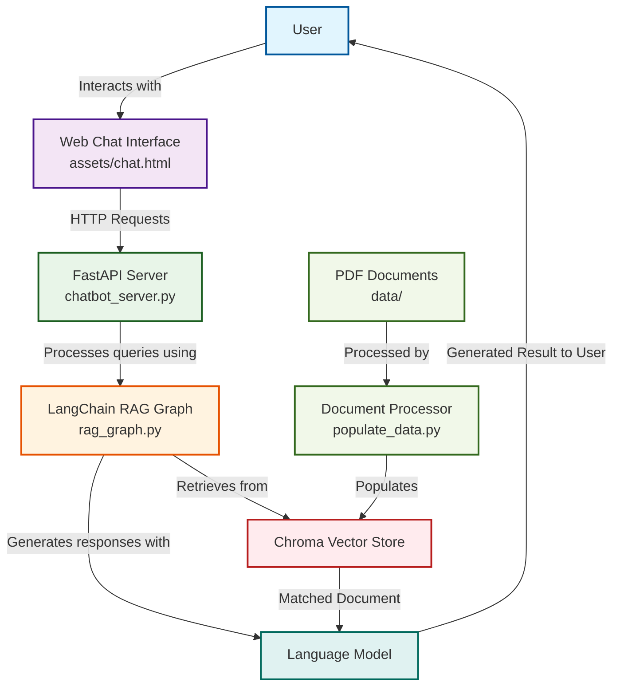

# RAG-based Chatbot with LangChain and FastAPI

A Retrieval-Augmented Generation (RAG) chatbot that combines document search capabilities with language model responses. The system uses LangChain's graph architecture for conversation flow, Chroma for vector storage, and FastAPI for the web interface.

## Features

- 🔍 **RAG Architecture**: Combines document retrieval with LLM responses
- 💾 **Vector Storage**: Uses Chroma for efficient document embedding and retrieval
- 🌐 **Web Interface**: Clean chat UI served via FastAPI
- 🔄 **Flexible LLM Support**: Works with multiple providers (Google Gemini, OpenAI, Ollama)
- 📚 **Document Processing**: Handles PDF documents with automatic chunking and embedding
- 🧵 **Conversation Threading**: Supports multiple conversation threads

---

## Project Structure

```
chatbot-rag/
├── assets/
│   └── chat.html          # Web chat interface
├── data/                  # Place your PDF documents here
├── chroma/               # Vector store directory
├── chatbot_server.py     # FastAPI server implementation
├── config.py            # Configuration settings
├── populate_data.py     # Document processing and embedding
├── rag_graph.py         # RAG implementation with LangChain
└── utils.py            # LLM and embedding utilities
```

## Setup

1. Create a virtual environment and install dependencies:
   ```bash
   python -m venv .venv
   .\.venv\Scripts\activate  # Windows
   source .venv/bin/activate # Linux/Mac
   pip install -r requirements.txt
   ```

2. Configure your environment: 
    update config.py file to update any keys.
    ```config.py
     GOOGLE_API_KEY=your_key_here
    ```
    In Production, keep these keys in .env ot environment manager and then use
3. Prepare your documents:
   - Place PDF files in the `data/` directory
   - Run the data population script:
     ```bash
     python populate_data.py
     ```
   - Use `--reset` flag to clear existing embeddings:
     ```bash
     python populate_data.py --reset
     ```

## Running the Chatbot

1. Start the server:
   ```bash
   python chatbot_server.py
   ```
   This will:
   - Start the FastAPI server on port 8081
   - Open the chat interface in your default browser
   - Initialize the RAG system with your document collection

2. The chat interface will be available at:
   - Web UI: http://localhost:8081
   - API endpoint: http://localhost:8081/api/chat

---

## 📐 Architecture



**Notes**
- **Routing**: The LangChain graph decides whether to call the retriever or go straight to the chat LLM.
- **Ingestion**: `populate_data.py` performs PDF parsing, chunking, and embeddings (Ollama) and writes to **Chroma**.
- **Runtime**: For document questions, the server embeds the query, searches **Chroma**, and sends retrieved context to the chat LLM. For greetings/small talk, it can skip retrieval.
- **Boundary**: The **Chat UI has no direct access** to PDFs, embeddings, or Chroma; **only the FastAPI server** touches those resources.
```
---

## Customization

### Language Models

You can modify `utils.py` to use different LLM providers:

1. OpenAI GPT:
   ```python
   # In utils.py
   from langchain_openai import ChatOpenAI
   llm = ChatOpenAI(model="gpt-4", temperature=0.0)
   ```

2. Google Gemini:
   ```python
   # In utils.py
   from langchain_google_genai import ChatGoogleGenerativeAI
   llm = ChatGoogleGenerativeAI(model="gemini-pro", temperature=0.0)
   ```

3. Local Ollama:
   ```python
   # In utils.py
   llm = init_chat_model("llama2", model_provider="ollama", temperature=0.0)
   ```

### Embeddings

The system uses Ollama's `nomic-embed-text` by default. To use alternatives, modify `get_embedding_function()` in `utils.py`:

```python
# For OpenAI embeddings
from langchain_openai import OpenAIEmbeddings
embeddings = OpenAIEmbeddings(model="text-embedding-3-large")
```

## API Usage

The chatbot exposes a simple REST API:

```python
# Example chat request
POST /api/chat
Content-Type: application/json

{
    "message": "What does the document say about revenue?",
    "thread_id": "conversation-1"  # Optional
}

# Response
{
    "response": "Based on the documents..."
}
```

## Contributing

1. Fork the repository
2. Create your feature branch
3. Commit your changes
4. Push to the branch
5. Create a new Pull Request

## License

This project is licensed under the MIT License - see the LICENSE file for details.
